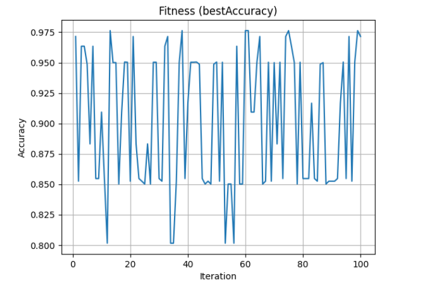

# SVM Letter Recognition Optimization

This project applies Support Vector Machine (SVM) classification to the UCI Letter Recognition Dataset. It includes hyperparameter tuning using GridSearchCV and a convergence analysis using a 100-iteration random search.

## Files

- `test.ipynb` – Jupyter Notebook containing code for data processing, training, optimization, and plotting
- `letter-recognition.data` – Dataset from the UCI Machine Learning Repository
- `convergence.png` – Plot showing accuracy improvement over 100 iterations on the best sample

## Methodology

1. **Data Preparation**
   - The UCI Letter Recognition dataset was used.
   - 10 random train-test splits (70/30) were generated.

2. **Model Training**
   - A Support Vector Classifier (`sklearn.svm.SVC`) was used.
   - GridSearchCV was applied on each sample using 3-fold cross-validation.
   - Parameters tuned:  
     - `kernel`: `['linear', 'rbf', 'poly']`  
     - `C`: `[0.1, 1, 10]`  
     - `gamma`: `['scale', 'auto']`

3. **Evaluation**
   - For each sample, accuracy was computed using the best parameters found by GridSearchCV.

4. **Convergence Plot**
   - The sample with the highest accuracy was selected.
   - A 100-iteration random search was performed.
   - The best accuracy so far was tracked at each iteration to visualize convergence behavior.

## Results Table

  Sample  Best Accuracy Kernel   C Gamma
0     S1       0.978500    rbf  10  auto
1     S2       0.974167    rbf  10  auto
2     S3       0.975833    rbf  10  auto
3     S4       0.977833    rbf  10  auto
4     S5       0.970833    rbf  10  auto
5     S6       0.978333    rbf  10  auto
6     S7       0.974667    rbf  10  auto
7     S8       0.975333    rbf  10  auto
8     S9       0.975000    rbf  10  auto
9    S10       0.976333    rbf  10  auto

*(Best results from 10 samples; full table generated in the notebook)*

## Convergence Plot

The following graph shows the accuracy achieved over 100 iterations of random hyperparameter selection for the best-performing sample.



- **X-axis**: Iteration number (1 to 100)
- **Y-axis**: Best accuracy so far
- This plot shows how accuracy improves as the search progresses, giving insight into optimization convergence.

## Libraries Used

- Python
- scikit-learn
- pandas
- matplotlib

## How to Run

1. Clone this repository:
   ```bash
   git clone https://github.com/your-username/svm-letter-recognition-optimization.git
   cd svm-letter-recognition-optimization
